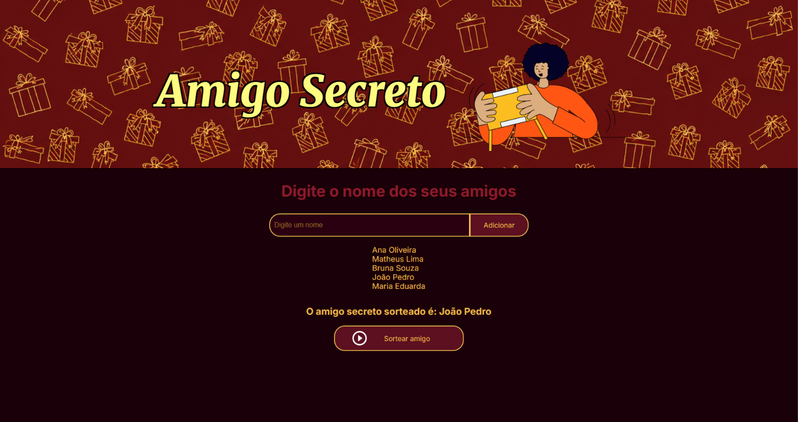

# 🎁 Amigo Secreto

Aplicação web desenvolvida como parte do challenge proposto pela **Alura** em parceria com o **Oracle Next Education (ONE)**. O projeto permite cadastrar participantes e realizar um sorteio aleatório para definir o amigo secreto de cada um.

---

## 🖥️ Demonstração



---

## 💡 Sobre o projeto

O desafio consistia em construir uma aplicação funcional do zero, aplicando conceitos de lógica de programação com JavaScript. Aproveitei para ir além do escopo básico e personalizar a interface com uma identidade visual própria, explorando CSS avançado e boas práticas de organização de código.

---

## ✨ Funcionalidades

- **Adicionar participantes** — campo de texto com validação: não aceita entradas vazias
- **Lista dinâmica** — os nomes aparecem na tela em tempo real conforme são adicionados
- **Sorteio aleatório** — seleciona um nome da lista de forma aleatória ao clicar no botão
- **Exibição do resultado** — o nome sorteado é apresentado de forma destacada na tela

---

## 🛠️ Tecnologias utilizadas

| Tecnologia | Uso |
|---|---|
| HTML5 | Estrutura semântica da página |
| CSS3 | Estilização, layout flexbox e responsividade |
| JavaScript (ES6+) | Lógica de validação, manipulação do DOM e sorteio |

---

## 📁 Estrutura de arquivos

```
ONE-Amigo_Secreto/
├── assets/
│   ├── amigo-secreto.png       # Ilustração do cabeçalho
│   ├── background.png          # Imagem de fundo
│   └── play_circle_outline.png # Ícone do botão sortear
├── index.html                  # Estrutura da aplicação
├── style.css                   # Estilos e identidade visual
├── app.js                      # Lógica e interatividade
└── README.md
```

---

## 🚀 Como executar localmente

```bash
# 1. Clone o repositório
git clone https://github.com/LeticiaHeeren/ONE-Amigo_Secreto.git

# 2. Acesse a pasta
cd ONE-Amigo_Secreto

# 3. Abra o arquivo no navegador
# Basta dar dois cliques em index.html
# ou usar a extensão Live Server no VS Code
```

Não há dependências nem instalações necessárias — o projeto roda diretamente no navegador.

---

## 📚 O que aprendi

- Manipulação do DOM com JavaScript puro (`getElementById`, `innerHTML`, `createElement`)
- Uso de arrays para gerenciar estado da aplicação
- Geração de índices aleatórios com `Math.random()` e `Math.floor()`
- Organização de projeto web em múltiplos arquivos
- Customização de identidade visual com variáveis CSS (`:root`)

---

## 🎨 Decisões de design

Optei pela paleta de cores **vinho e dourado**, criando uma atmosfera mais festiva e adequada ao tema de amigo secreto. As variáveis CSS no `:root` facilitaram a consistência das cores em toda a aplicação.

---

## 👩‍💻 Autora

**Leticia Heeren**
Estudante de tecnologia | Formação Oracle Next Education (ONE) + Alura

[](https://github.com/LeticiaHeeren)

---

*Projeto desenvolvido para fins educacionais como parte do programa Oracle Next Education.*